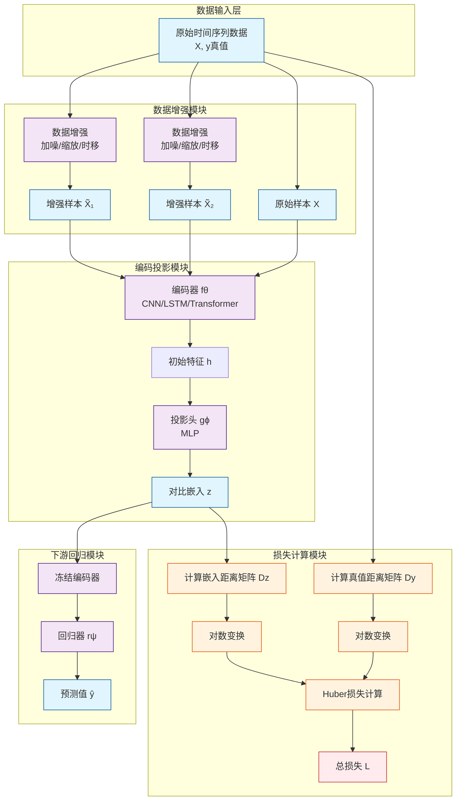

# 时间序列回归对比学习框架

## 架构图

```mermaid
graph TD
    subgraph "数据输入层"
        A[原始时间序列数据<br/>X, y真值]
    end
    
    subgraph "数据增强模块"
        B[数据增强<br/>加噪/缩放/时移]
        C[数据增强<br/>加噪/缩放/时移]
        A --> B
        A --> C
        B --> D[增强样本 X̃₁]
        C --> E[增强样本 X̃₂]
        A --> F[原始样本 X]
    end
    
    subgraph "编码投影模块"
        D --> G[编码器 fθ<br/>CNN/LSTM/Transformer]
        E --> G
        F --> G
        G --> H[初始特征 h]
        H --> I[投影头 gϕ<br/>MLP]
        I --> J[对比嵌入 z]
    end
    
    subgraph "损失计算模块"
        J --> K[计算嵌入距离矩阵 Dz]
        A --> L[计算真值距离矩阵 Dy]
        K --> M[对数变换]
        L --> N[对数变换]
        M --> O[Huber损失计算]
        N --> O
        O --> P[总损失 L]
    end
    
    subgraph "下游回归模块"
        J --> Q[冻结编码器]
        Q --> R[回归器 rψ]
        R --> S[预测值 ŷ]
    end
    
    %% 样式定义
    classDef data fill:#e1f5fe,stroke:#01579b
    classDef process fill:#f3e5f5,stroke:#4a148c
    classDef model fill:#fff3e0,stroke:#e65100
    classDef loss fill:#ffebee,stroke:#c62828
    classDef output fill:#e8f5e8,stroke:#2e7d32
    
    class A,D,E,F,J,S data
    class B,C,G,I,Q,R process
    class K,L,M,N,O model
    class P loss
```
